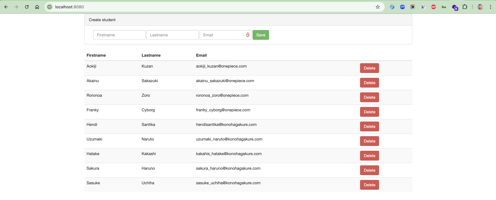

# SpringBootReact
Spring Boot + React.js

Simple CRUD application with Spring Boot Data REST backend and React.js frontend. Application uses H2 runtime database and contains demodata.

Launch app by typing: `mvnw clean spring-boot:run`

* H2
* JPA
* REST
* React.js

## Screenshot

